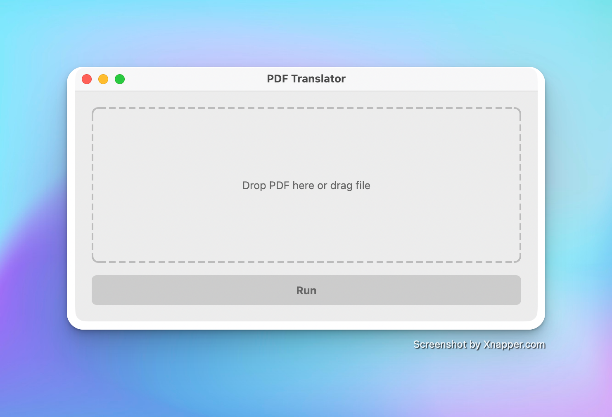
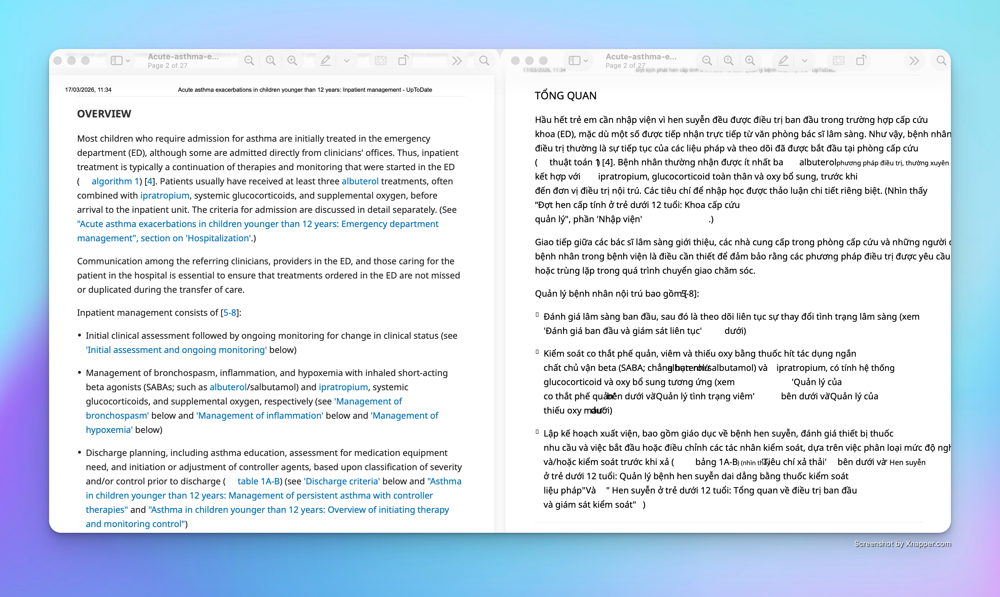

# Layout-Preserving PDF Translator

A powerful native GUI application designed to translate PDF documents (English to Vietnamese) while flawlessly preserving their original layout, formatting, and images. 




## ✨ Features

- **Drag & Drop Interface**: Simple, modern, and intuitive `PySide6` GUI. Drag your PDF in, and watch the progress!
- **100% Layout Retention**: Uses advanced `PyMuPDF` (`fitz`) capabilities to effectively clone the original document's structure, wiping original text and rewriting translated layers while keeping all images, tables, and colors intact.
- **Smart Text Fitting**: Automatically calculates bounding boxes and dynamically scales font sizes down so translated text fits perfectly inside the original visual boundaries.
- **Parallel Translation Engine**: Achieves high-performance translation speeds using multi-threaded execution (`ThreadPoolExecutor`).
- **Hybrid Online/Offline Architecture**: 
  - Rapidly fetches translations via `GoogleTranslator` (`deep_translator`) for the highest accuracy.
  - Automatically safely falls back to a locally hosted, offline AI translation model (`argostranslate`) to ensure translation resilience.
- **Smart Result Naming**: Your translated file is saved safely alongside the original as `*_translated.pdf`.

---

## 💻 Developer Setup 

### 1. Requirements
Ensure you are running **Python 3.9+**. Working within a virtual environment is strongly recommended.

### 2. Environment Setup

Clone the repository and set up your python environment:

```bash
# Create a virtual environment
python3 -m venv venv

# Activate it (macOS/Linux)
source venv/bin/activate
# Or on Windows:
# venv\Scripts\activate

# Install fundamental dependencies
pip install PySide6 PyMuPDF deep-translator argostranslate
```

### 3. Install Offline Translation Models
Because this application uses `argostranslate` for offline translation fallbacks, you need to download and cache the English-to-Vietnamese translation model locally before running the logic map:

```bash
python install_model.py
```
*(This script will output progress as it securely downloads and links the EN→VI language pack).*

### 4. Running the Application
To run the application directly from the source code:
```bash
python main.py
```

---

## 🛠️ Building Executables (Standalone Apps)

If you want to package and distribute this tool as a standalone application without requiring the end-user to have Python installed, you can use `PyInstaller`. 

> **Note on fonts:** The build scripts and `main.py` are properly configured to securely map `NotoSans-Regular.ttf` through `sys._MEIPASS` so fonts bundle natively without missing resource errors.

### Build for macOS
```bash
chmod +x build_mac.sh
./build_mac.sh
```
*Your application bundle (`main.app`) will be created inside the generated `dist/` directory.*

### Build for Windows
Move the project structure to a Windows machine and simply execute the batch script:
```cmd
build_windows.bat
```
*Your `main.exe` executable will be placed inside the generated `dist/` directory.*
